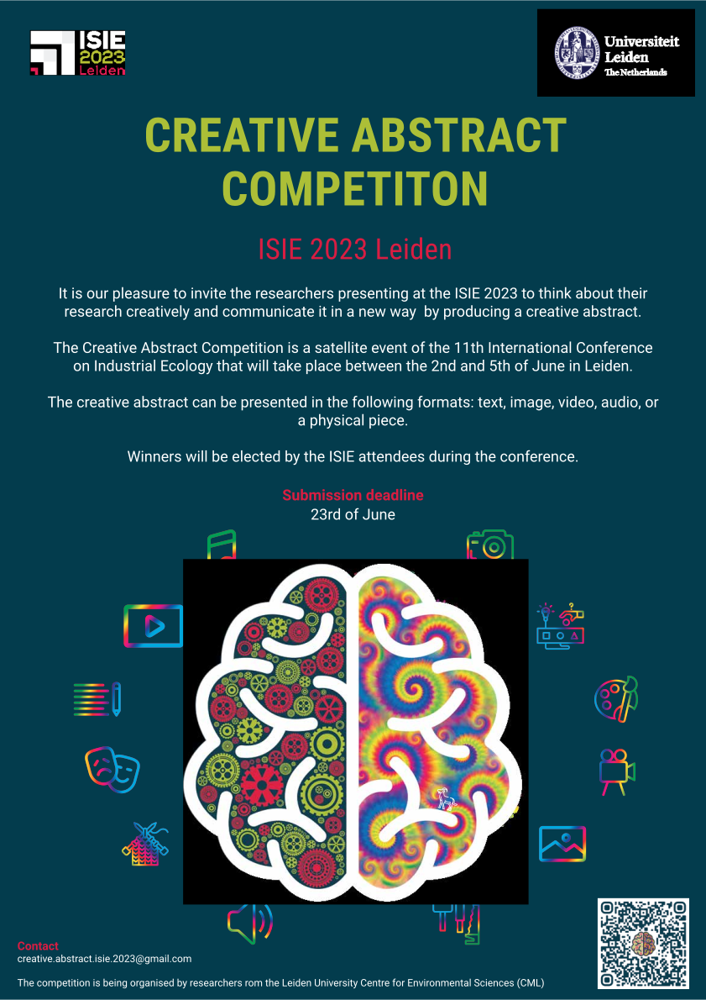

# The ISIE 2023 Creative Abstract Competition

-----------------------------------------------------------------------------------------------------------------------------
### Get ready for the "Creative Abstract Competition" at the International Society of Industrial Ecology (ISIE) Conference, happening on 1-5 July 2023 in Leiden!
---
### We are inviting researchers and professionals from around the world to showcase their innovative ideas related to sustainability, innovation, and engineering in the form of text, physical, video, or audio. 
---
### This is your chance to demonstrate your creativity and originality, and gain recognition for your work on a global platform. 
---
### Join us for this exciting competition and get a chance to win amazing prizes! 

### Check out our website for more information and to register your entry.
-----------------------------------------------------------------------------------------------------------------------------
## Check out our [webpage](https://isie-2023-creativeabstractcompetition.github.io/)
## Read the official competition [documents](documents)

## Read our [flyer](ISIE2023_CreativeAbstractCompetition.pdf)

v